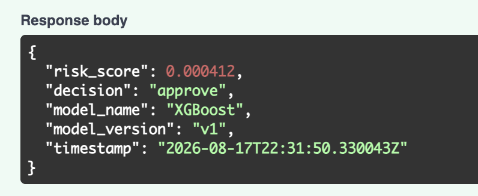
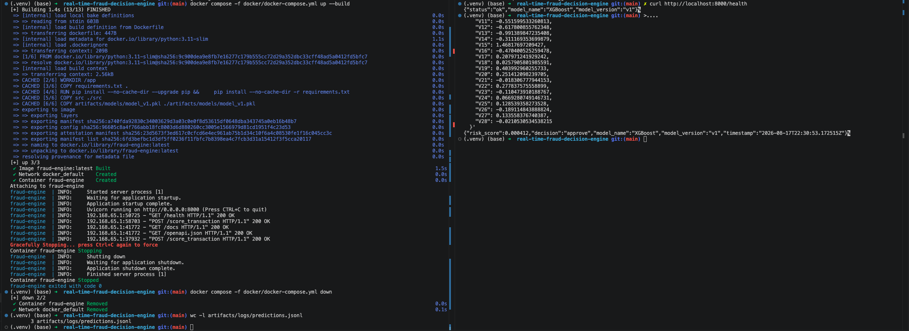

# Real-Time AI Fraud Decision Engine

Local fraud detection project. Goal is to train a model on transaction data, serve it through a FastAPI endpoint, and turn the model's fraud probability into a 3-way decision: approve, review, or block.

See [`ARCHITECTURE.md`](./ARCHITECTURE.md) for the design and [`tasks.md`](./tasks.md) for the day-by-day plan.

---

## Table of Contents

- [Overview](#overview)
- [Business Problem](#business-problem)
- [Architecture](#architecture)
- [Dataset](#dataset)
- [Model Training](#model-training)
- [API](#api)
- [Monitoring](#monitoring)
- [Local Setup](#local-setup)
- [Next Steps](#next-steps)
- [Limitations & Future Work](#limitations--future-work)

---

## Overview

This is a small end-to-end fraud scoring system, not just a model in a notebook. It includes a data pipeline, trained model, API, experiment tracking, Docker setup, and basic logging and drift checks. Nothing fancy. The point is to have a working system I can explain, not a from-scratch research project.

Rough scope:
- Train a classifier (starting with logistic regression, then XGBoost) on a public transaction dataset.
- Serve predictions through `POST /score_transaction` in FastAPI. Aiming for well under 50ms per request, but I haven't measured this yet.
- Turn the raw fraud probability into approve / review / block using two thresholds.
- Explain predictions with SHAP: global feature importance plus local explanations for sample transactions.
- Track training runs in MLflow.
- Run the API in Docker.
- Log predictions and do a basic drift check against the training data.

The core training, API, MLflow tracking, Docker deployment, prediction logging, and a lightweight drift check are implemented locally. See [`tasks.md`](./tasks.md) for the remaining documentation, demo, and cleanup work.

---

## Business Problem

The reason for a 3-way decision instead of plain fraud/not-fraud: a single threshold forces every transaction into one of two buckets, but a lot of transactions aren't confidently either. Blocking a real customer costs you a customer. Letting real fraud through costs you money directly. Treating everything the same way with one cutoff ignores that.

So instead of one threshold, there are two:

| Decision | Meaning | What happens next |
|---|---|---|
| Approve | Low risk score | Goes through automatically |
| Review | Score in the middle | Gets flagged for manual review / extra auth |
| Block | High risk score | Auto-declined |

Current working thresholds are `T1 = 0.10` and `T2 = 0.89`. The validation sweep was used to narrow them down, but the raw `T1 = 0.00` suggestion would have sent nearly every validation transaction to review. I set `T1 = 0.10` to keep the approve/review/block policy usable, while `T2 = 0.89` remains the stricter boundary for auto-blocking.

---

## Architecture

Full write-up in [`ARCHITECTURE.md`](./ARCHITECTURE.md) - components, training pipeline, inference flow, monitoring, and what's in scope vs. cut for later.

Rough flow (offline training -> online serving):

```
[Raw transaction data] -> [data pipeline] -> [training pipeline] -> [saved model]
                                                                          |
                                                                          v
                                                          [FastAPI /score_transaction]
                                                                          |
                                                                          v
                                          [risk_score + decision + model_name + model_version + timestamp]
                                                                          |
                                                                          v
                                                [prediction log] -> [drift check]
```

A diagram image is a remaining documentation improvement; the flow above reflects the current implementation.

---

## Dataset

- Source: [Kaggle - Credit Card Fraud Detection (mlg-ulb)](https://www.kaggle.com/datasets/mlg-ulb/creditcardfraud)
- Size: 284807 rows, 31 columns
- Label distribution: 0.1727% fraudulent / 99.8273% non-fraudulent (highly imbalanced)
- Key features: `Time`, `Amount`, `V1`-`V28` (PCA-anonymized features), `Class` (target)
- License / usage notes: Public Kaggle dataset, for research/educational use. Features `V1`-`V28` are already PCA-transformed and anonymized by the dataset provider, so the original raw features are unavailable.
- EDA notebook: [`notebooks/01_eda.ipynb`](./notebooks/01_eda.ipynb)

---

## Model Training

Trained two initial models on the Kaggle credit card fraud dataset:
- Logistic Regression with `class_weight="balanced"` as the simple baseline
- XGBoost as the stronger tree-based model

Because the dataset is extremely imbalanced, PR-AUC matters more than plain accuracy, so that's the main number I'm using to compare models right now.

| Model | Precision | Recall | F1 | PR-AUC |
|---|---|---|---|---|
| Logistic Regression (baseline) | 0.0626 | 0.9082 | 0.1172 | 0.7190 |
| XGBoost (selected) | 0.7568 | 0.8571 | 0.8038 | 0.8688 |

A few takeaways from the first run:
- Logistic Regression finds most fraud cases, but it throws way too many false positives.
- XGBoost is much more usable as a starting point: recall is still strong, precision is dramatically better, and it wins clearly on PR-AUC.
- So for now, XGBoost is the saved model artifact for v1.

Current implementation notes:
- Class imbalance handling:
    - Logistic Regression uses `class_weight="balanced"`
    - XGBoost uses `scale_pos_weight` based on the training split
- Decision thresholds:
    - These metrics are still using the model's default classification threshold
    - Current working thresholds in `src/models/infer.py` are `T1 = 0.10` and `T2 = 0.89`
    - These came from the validation threshold sweep, but I overrode the raw `T1 = 0.00` suggestion because it pushed almost the entire validation set into `review`
- Explainability:
    - SHAP global importance and two local transaction explanations are in `notebooks/02_modeling.ipynb`
    - The notebook saves plots to `artifacts/metrics/`
    - I have SHAP working in the notebook, but haven't added it to the API response yet.
- Experiment tracking:
    - MLflow records parameters, precision, recall, F1, PR-AUC, confusion-matrix JSON artifacts, and the winning `model_v1.pkl` artifact.
    - Runs are stored locally in `mlruns/` under the `fraud-decision-engine` experiment and are not committed to Git.
- Training code: [`src/models/train.py`](./src/models/train.py)

The basic training pipeline is working end to end and producing a model artifact. I also have a separate threshold-sweep script now, which I used to pick the current working T1/T2 values before wiring them into inference.

---

## API

Built locally and tested with FastAPI's Swagger UI, curl, and pytest.

Base URL (local): `http://localhost:8000`

### `GET /health`
Checks that the model artifact loaded when the service started.

### `POST /score_transaction`

Scores one transaction and returns its fraud risk score plus an `approve`, `review`, or `block` decision.

The current v1 model was trained on the Kaggle feature set, so the endpoint expects all 30 model inputs: `Time`, `Amount`, and `V1` through `V28`. A simplified transaction schema is a later cleanup item once there is a feature-building layer in front of the model.

Response shape:
```json
{
  "risk_score": 0.000412,
  "decision": "approve",
  "model_name": "XGBoost",
  "model_version": "v1",
  "timestamp": "<ISO-8601 timestamp>"
}
```

### Curl example

The request below uses the first transaction row from the dataset, with the label removed:

```bash
curl -sS -X POST "http://localhost:8000/score_transaction" \
  -H "Content-Type: application/json" \
  -d '{
    "Time": 0.0,
    "Amount": 149.62,
    "V1": -1.3598071336738,
    "V2": -0.0727811733098497,
    "V3": 2.53634673796914,
    "V4": 1.37815522427443,
    "V5": -0.338320769942518,
    "V6": 0.462387777762292,
    "V7": 0.239598554061257,
    "V8": 0.0986979012610507,
    "V9": 0.363786969611213,
    "V10": 0.0907941719789316,
    "V11": -0.551599533260813,
    "V12": -0.617800855762348,
    "V13": -0.991389847235408,
    "V14": -0.311169353699879,
    "V15": 1.46817697209427,
    "V16": -0.470400525259478,
    "V17": 0.207971241929242,
    "V18": 0.0257905801985591,
    "V19": 0.403992960255733,
    "V20": 0.251412098239705,
    "V21": -0.018306777944153,
    "V22": 0.277837575558899,
    "V23": -0.110473910188767,
    "V24": 0.0669280749146731,
    "V25": 0.128539358273528,
    "V26": -0.189114843888824,
    "V27": 0.133558376740387,
    "V28": -0.0210530534538215
  }'
```

Example response:

```json
{
  "risk_score": 0.000412,
  "decision": "approve",
  "model_name": "XGBoost",
  "model_version": "v1",
  "timestamp": "<ISO-8601 timestamp>"
}
```

The timestamp changes on every request.

Example response from the interactive Swagger UI:



Run the API locally:

```bash
uvicorn src.api.main:app --reload --port 8000
```

Use the Swagger UI at `http://localhost:8000/docs` to send a real sample row from the dataset for now. The endpoint has also been tested with FastAPI's `TestClient`.

---

## Monitoring

Successful `POST /score_transaction` requests are appended as JSON Lines records to:

```text
artifacts/logs/predictions.jsonl
```

Each record includes:
- `logged_at`
- the validated 30-feature `transaction` payload
- `risk_score`
- `decision`
- `model_name`
- `model_version`
- `prediction_timestamp`

Requests rejected by FastAPI validation, such as a request missing `V28`, return HTTP 422 and are not logged.

### Drift check

Run the local PSI-based drift check on demand:

```bash
python -m src.monitoring.drift_checks
```

The script compares logged transaction values for `Amount`, `V1`, `V2`, `V3`, and `V4` against the original training distribution. It uses a PSI threshold of `0.20`, prints a per-feature summary, and writes a JSON report to:

```text
artifacts/metrics/drift_report.json
```

This is lightweight, local monitoring rather than a live dashboard or alerting system. The initial five-request repeated-payload demo intentionally produces alerts because it is not a representative production sample; it validates the monitoring pipeline rather than proving real-world data drift.

---

## Local Setup

### Requirements
- Python 3.11+
- Docker (optional, only needed if you want the containerized version)

### Python
```bash
python -m venv .venv
source .venv/bin/activate      # Windows: .venv\Scripts\activate
pip install -r requirements.txt
uvicorn src.api.main:app --reload --port 8000
```
Then open `http://localhost:8000/docs` for the interactive API docs.

### Docker

Build and run the API with Docker Compose:

```bash
docker compose -f docker/docker-compose.yml up --build
```

Open `http://localhost:8000/docs` to use the API.

Stop and remove the container/network with:

```bash
docker compose -f docker/docker-compose.yml down
```

The Compose configuration bind-mounts `artifacts/logs/` into the container, so successful prediction logs remain on the host after the container is removed.

Containerized API run, successful score request, and persisted prediction log:



### Tests
```bash
pytest tests/
```
Current coverage includes inference thresholds, feature-row validation, API health, a valid scoring request, and an invalid scoring request. Run `pytest tests/` to see the current test count.

### MLflow UI
```bash
mlflow ui --backend-store-uri ./mlruns
```
Then open `http://localhost:5000` to inspect the local `fraud-decision-engine` experiment and its nested Logistic Regression and XGBoost runs.

---

## Next Steps

Full task breakdown in [`tasks.md`](./tasks.md). Where things stand:

- [x] Day 1: repo scaffold, requirements.txt, README/ARCHITECTURE/tasks docs
- [x] Day 1: pick dataset, download it, basic EDA
- [x] Day 2: preprocessing pipeline + baseline model
- [x] Day 3: threshold analysis, inference logic, and SHAP explainability
- [x] Day 4: FastAPI service
- [x] Day 5: MLflow, Docker, monitoring
- [ ] Day 6: docs, demo, cleanup

---

## Limitations & Future Work

A few limits are worth being explicit about:

- This uses a static dataset, not an actual real-time transaction stream. "Real-time" here means the API responds fast, not that it's hooked up to live data.
- Drift monitoring is a manual/periodic check, not a live dashboard or alerting.
- Thresholds were selected from one dataset snapshot and would need to be re-checked against live data before any real deployment.
- No auth or rate limiting on the API. Fine for a local demo, not fine for production.

See [`ARCHITECTURE.md`](./ARCHITECTURE.md#8-v1-scope-vs-stretch-scope) for what's in scope for this project vs. what I'm deliberately skipping.

---

## Tech Stack

Python 3.11, pandas, scikit-learn, XGBoost, imbalanced-learn, SHAP, FastAPI, Pydantic, MLflow, Docker, pytest, and a custom PSI-based drift check.

Why each one is here: see [`ARCHITECTURE.md`](./ARCHITECTURE.md#10-tech-stack-rationale).
